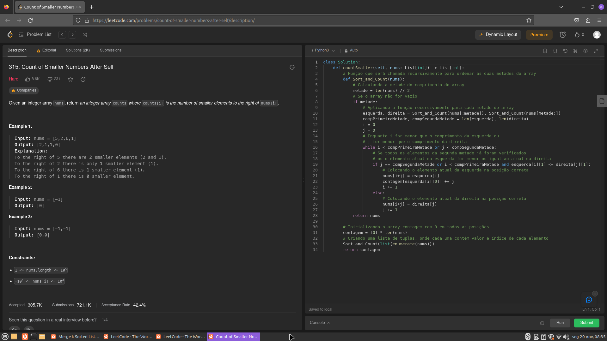
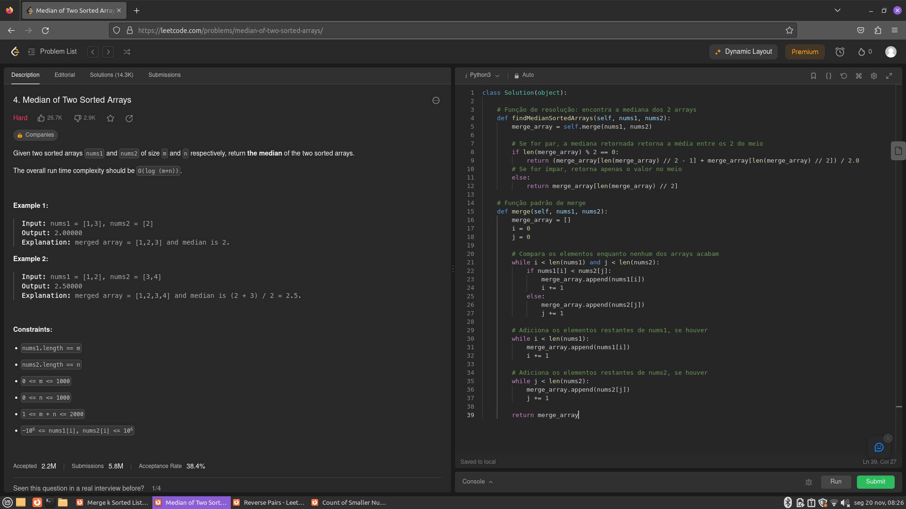
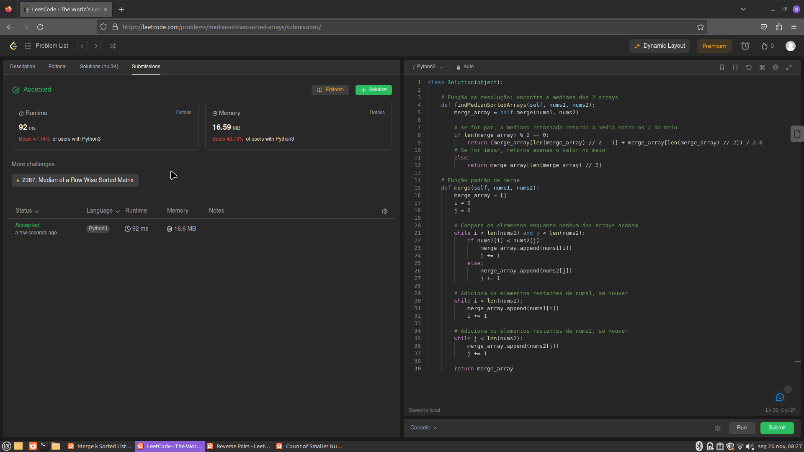
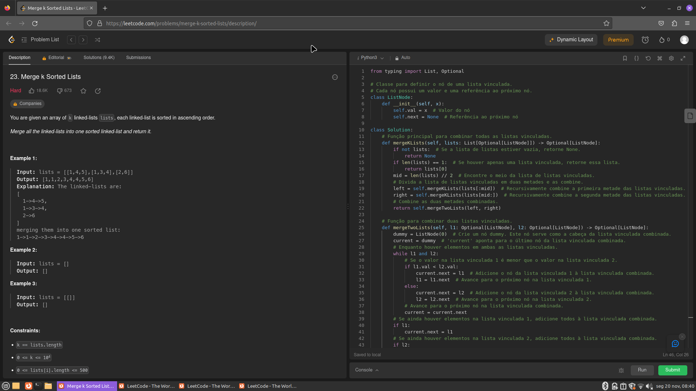
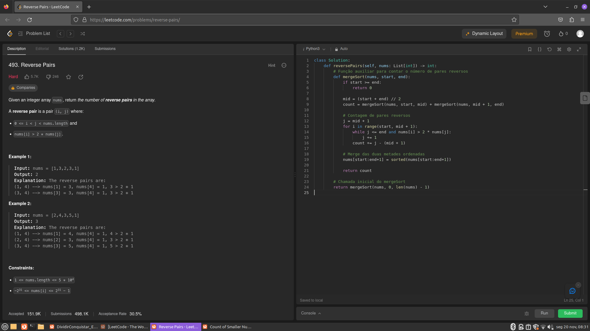
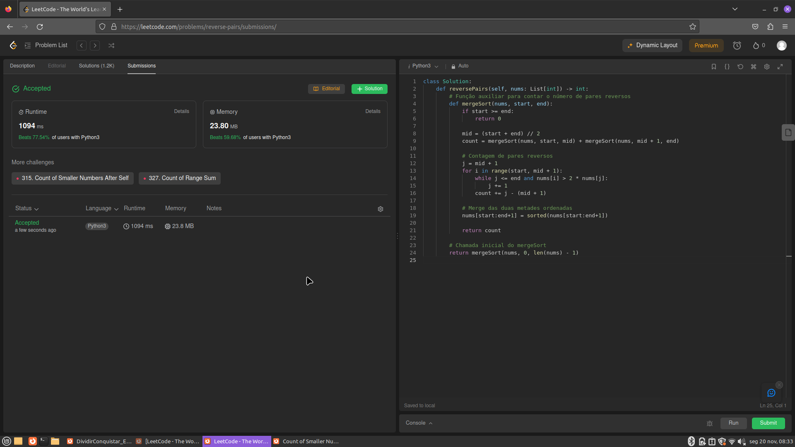

## Dividir e Conquistar Exercicios Juiz Online
 
- Número na Lista : 33  
- Conteúdo da Disciplina: Dividir e Conquistar  

## Alunos
|Matrícula | Aluno |
| -- | -- |
| 19/0142421  |  Artur Vinicius Dias Nunes |

## Sobre 
Exercicios resolvidos de juizes onlines LeetCode, sobre o tema dividir e conquistar.

[Count_of_smaller_numbers_after_self](https://leetcode.com/problems/count-of-smaller-numbers-after-self/submissions/)  
[Median_of_Two_Sorted_Arrays](https://leetcode.com/problems/median-of-two-sorted-arrays/submissions/)  
[Merge_k_sorted_lists](https://leetcode.com/problems/merge-k-sorted-lists/submissions/) 
[Reverse_Pairs](https://leetcode.com/problems/reverse-pairs/submissions/) 

## Screenshots

## Instalação 
**Linguagem**: Python 

## Uso 
Para executar os programas, basta baixar os códigos e submetê-los em um compilador online ou em um editor de código-fonte.

## Vídeos

